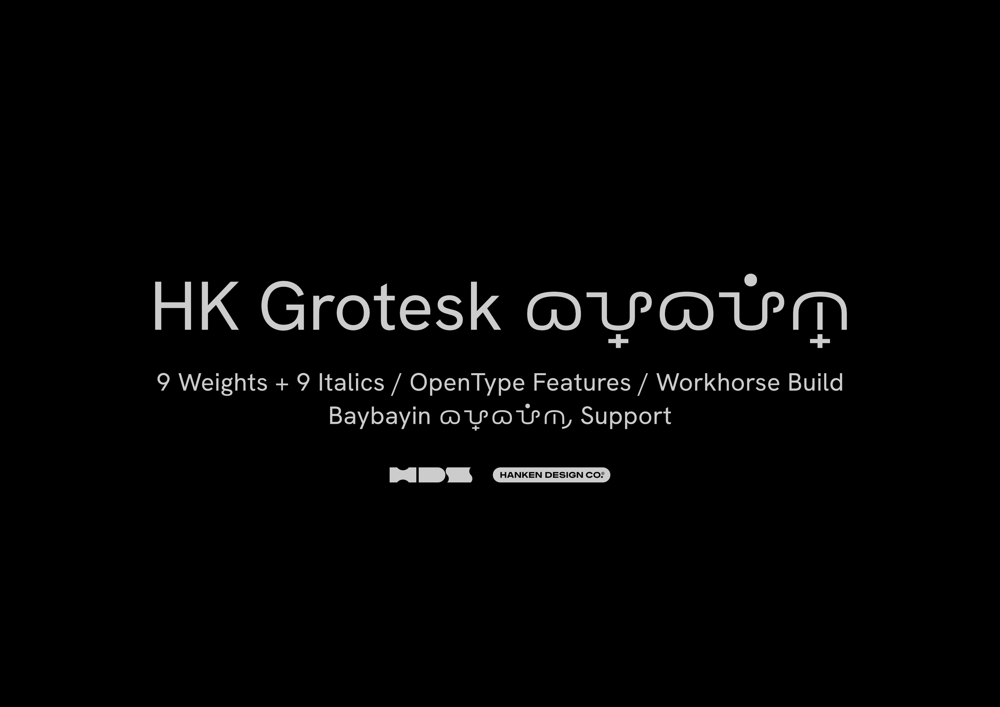
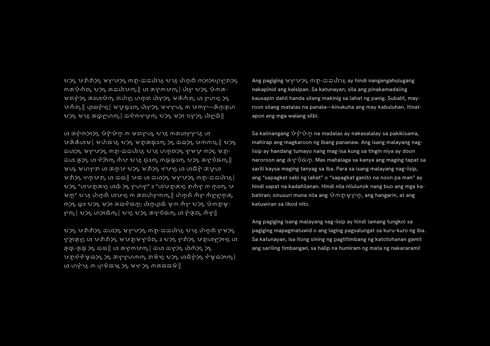
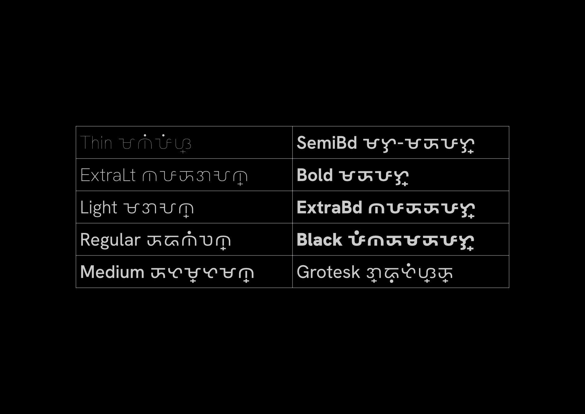
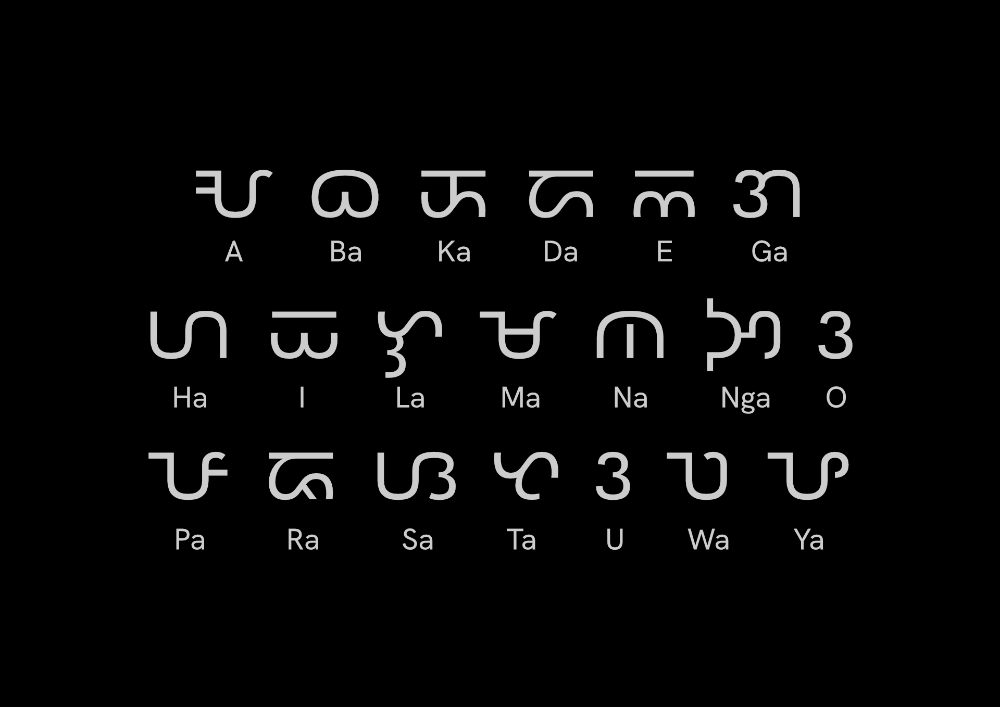
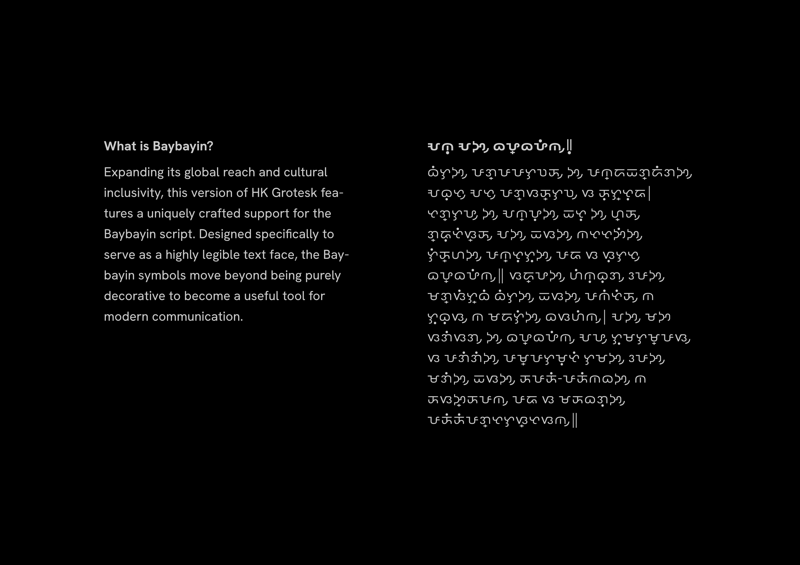
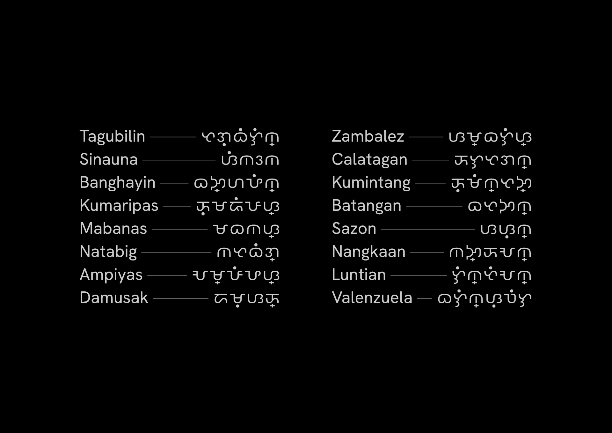
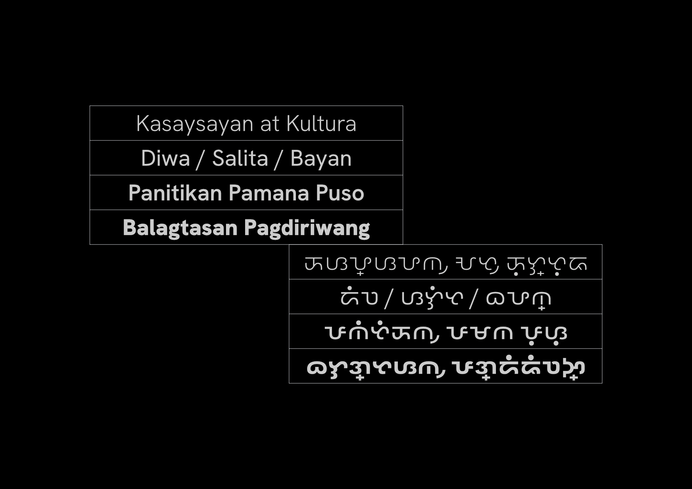
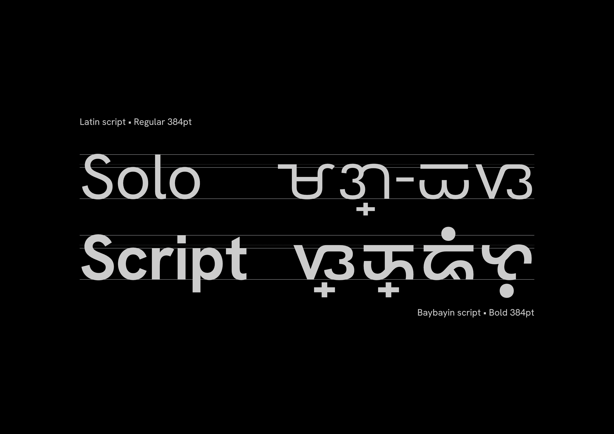
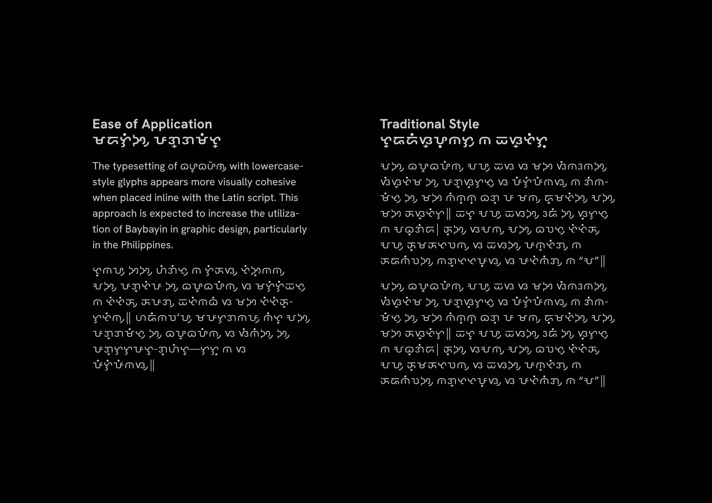
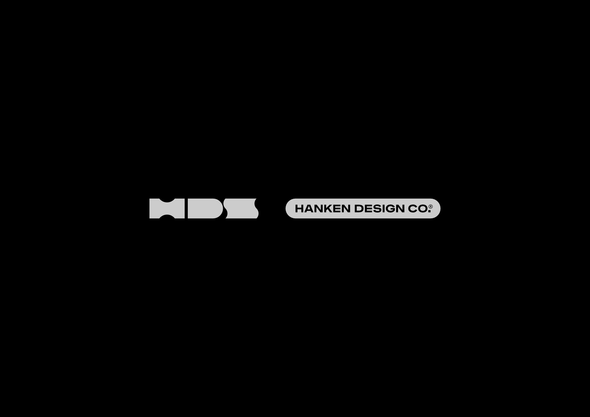

# HK Grotesk Baybayin

A Baybayin script typeface based on Hanken Grotesk.

---

## Typeface Overview

HK Grotesk Baybayin is a Baybayin script typeface based on the Hanken Grotesk design. Baybayin is a pre-colonial Philippine script used by the Tagalog, Kapampangan, and Pangasinan peoples. This project adapts the Hanken Grotesk Neo-Grotesque design to support Baybayin characters while maintaining visual consistency with the original Latin typeface.

The HK Grotesk Baybayin project is led by Alfredo Marco Pradil.

---

## Gallery

<table>
  <tr>
    <td></td>
    <td></td>
  </tr>
  <tr>
    <td></td>
    <td></td>
  </tr>
  <tr>
    <td></td>
    <td></td>
  </tr>
  <tr>
    <td></td>
    <td></td>
  </tr>
  <tr>
    <td></td>
    <td></td>
  </tr>
</table>

---

## Font Family

| Style | Weight | Width | Optical Sizing |
|-------|--------|-------|----------------|
| Thin | 100 | Normal | Yes |
| ExtraLight | 200 | Normal | Yes |
| Light | 300 | Normal | Yes |
| Regular | 400 | Normal | Yes |
| Medium | 500 | Normal | Yes |
| SemiBold | 600 | Normal | Yes |
| Bold | 700 | Normal | Yes |
| ExtraBold | 800 | Normal | Yes |
| Black | 900 | Normal | Yes |

### Italic Styles

All weights are available in both upright and italic variants.

---

## Technical Specifications

### Supported Formats

- **TrueType (TTF)** — `fonts/`

### Character Set

- **Baybayin** — U+1700–U+171F (Tagalog)
- **Latin Basic** — U+0020–U+007F
- **Latin Extended-A** — U+0100–U+017F

### OpenType Features

#### GSUB (Glyph Substitution)

| Feature | Tag | Description |
|---------|-----|-------------|
| All Alternates | `aalt` | Access all available glyph alternates |
| Case-Sensitive Forms | `case` | Adjusts punctuation for capitals |
| Glyph Composition/Decomposition | `ccmp` | Composes/decomposes glyphs |
| Discretionary Ligatures | `dlig` | Optional stylistic ligatures |
| Denominators | `dnom` | Denominator figures |
| Fractions | `frac` | Diagonal fractions |
| Standard Ligatures | `liga` | Common ligatures (fi, fl, etc.) |
| Localized Forms | `locl` | Language-specific character forms |
| Numerators | `numr` | Numerator figures |
| Ordinals | `ordn` | Ordinal forms (1st, 2nd, 3rd) |
| Proportional Figures | `pnum` | Proportional width numerals |
| Stylistic Set 1 | `ss01` | Stylistic alternates |
| Superscript | `sups` | Superscript characters |
| Tabular Figures | `tnum` | Monospaced numerals |

#### GPOS (Glyph Positioning)

| Feature | Tag | Description |
|---------|-----|-------------|
| Capital Spacing | `cpsp` | Spacing adjustments for capitals |
| Kerning | `kern` | Kerning pairs |
| Mark Positioning | `mark` | Positioning of combining marks |
| Mark to Mark Positioning | `mkmk` | Positioning of marks relative to marks |

---

## Project Structure

```
hk-grotesk-baybayin/
├── fonts/                 # TrueType fonts
├── images/                # Specimen images
├── OFL.txt               # SIL Open Font License
├── README.md
├── CONTRIBUTORS.txt
└── AUTHORS.txt
```

---

## Contributing

Contributions are welcome. Please review the [contribution guidelines](CONTRIBUTORS.txt) before submitting enhancements or bug fixes.

---

## License

HK Grotesk Baybayin is distributed under the **SIL Open Font License 1.1**.

See [OFL.txt](OFL.txt) for full license text.

---

## Related Projects

| Project | Description |
|---------|-------------|
| [hanken-grotesk](https://github.com/marcologous/hanken-grotesk) | Original Hanken Grotesk Latin typeface |

---

*Built by [Hanken Design Co.](https://hankendesign.co)*